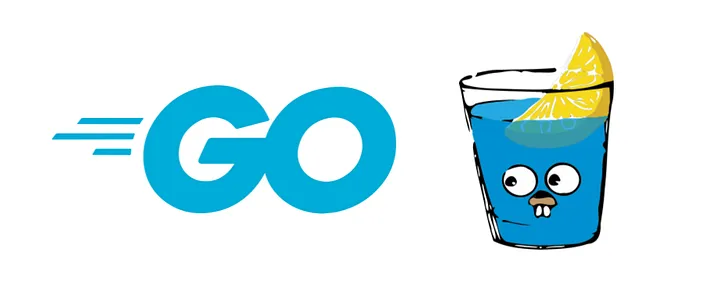

# Go gin boilerplate

	

## Summary

This is a boilerplate designed for training purposes. This project covers severalkey topics, including:
- MVC Pattern for GO
- Pointers (& and *) in GO
- Gin framework
- Gorm ORM
- Docker (specifically for Postgres and PgAdmin)

## Quick Start

### Clone repository

`git clone https://github.com/Leoujo/gin-api-rest.git`

### 1. Add your .env file
`create based on the .env.template folder`

### 2. Run Docker

`docker-compose up`

### 3. Run the Go project :)

`go run main.go`

## Endpoints 
- Create student-> DELETE http://localhost:8080/students

- Get all students -> GET http://localhost:8080/students
- Get student by id -> GET http://localhost:8080/students/:id
- Get student by cpf -> GET http://localhost:8080/students/cpf/:cpf

- Edit student by ID -> PATCH http://localhost:8080/students/:id
- Delete student by ID -> DELETE http://localhost:8080/students/:id
